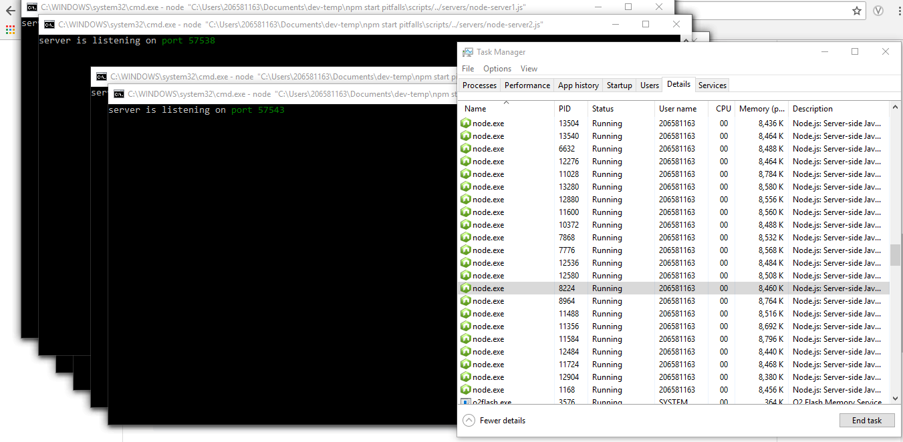

# The Pitfalls of Npm Start and Child Processes

**tl;dr:** [`npm run <script>`](https://docs.npmjs.com/cli/run-script) creates an extra node process to actually run your command. Child processes can sometimes be orphaned from the parent and, in cases where you are using a process manager to auto-restart downed services, can cause your server to get bloated with thousands of orphaned child processes.

-----------------------------------------------------------
### Introduction

This repo exists to help people learn about an aspect of node/npm that may not be desirable in production environment: extraneous node processes.

When running the following tests on windows (which is what this is targeted at), I recommend having task manager open on the 'Details' page to see all of your node instances.

If you'd like to play around with creating different numbers of child processes, there is a `--count <instances>` argument you can mess around with. This is for any of the scripts in the [`/scripts`](scripts/) folder.

**NOTE:** This repo was made using the latest version of npm at the time, v6.1.0, and may have different effects on linux or mac systems.

-----------------------------------------------------------

## Npm Start Adds an Extra Node Process

Run `npm install` and then run the following command in a terminal:

`node ./servers/node-server.js`

In your task manager you should see only one node process. Slow and obvious progress I know, but it's important for the next bit. `Ctrl+C` and run:

`npm run start:one`

Now looking at the task manager you will see that there are _two_ node processes created to run one server. Npm's run command is written similarly to the [`start-managed-processes.js`](scripts/start-managed-processes.js) file, i.e. creates a node instance that can then run the commands via a child process. More can be read about this [here](https://docs.npmjs.com/cli/run-script).

Now, running one extra instance of node won't be a big deal for most people. The main conceivable issues would arise from instances where node/npm is not able to be cleaned up correctly on termination, which leads us to...

## Orphaned Child Processes

Run this command in a terminal:

`npm start`

This command runs the [`start-processes.js`](scripts/start-processes.js) node script. Looking at the Details view of the task manager you'll see **four** node processes: the node instances for the npm script, the node instance for our script that starts the servers, and our two servers. This might be troubling, but something worse happens when you `Ctrl+C` out of the script: _only 2 of the 4 processes are actually killed._

This is happening because of the parent-child relationship of the node processes. When the parent npm script is killed, the child process is also killed. But since the children shells of the child process were not written to respond to their parent exiting, they continue running in a disconnected state. To better understand this, read the section on [Process Groups](#process-groups) below.

**Note** that for this particular instance, it is the child of `npm start` that is actually causing the orphaned processes. `node .` will have the same effect, albeit with one less process (3 instead of 4).

## New Generations of Orphaned Processes

Knowing that node child processes can continue long after their parent process was killed, what are some implications?

For at least one example, imagine that a company has a script (much like [`create-orphans.js`](scripts/create-orphans.js)) in production that spawns 2 child shells. And their team - having good microservices developers - installed pm2 to monitor their application's health and autorestart when the application fails.

It should already be obvious where this is going but in case it isn't, run the following script (but don't foget to close it!):

`npm run pm2:orphans`

I've written the `create-orphans.js` script to error out after 5 seconds. When pm2 realizes that the script is down it will automatically restart it.

If you don't already have a look of pure terror shining on your face, let me reiterate:
**Spawning child processes in node can blow up your production machines if not done correctly**

It's worth noting that this is a _worst case_ scenario. This specific situation will happen when: 
- Child processes are spawned in a new [Process Group](#process-groups)
- Poor error handling is present in the app
- A process manager with autorestart is used

Can it happen in other settings? Sure, but this is most likely situation I can think of.

## Child Process Exit on Parent Exit, Or, Exec Versus Fork

To bring it all back around, we need to find a good way to decrease the chances of orphaned child processes. If the parent exits, the child should as well. In the case of `child_process.exec()`, we are actually using the wrong code. Node comes pre-baked with a more safe and preformant way of spinning up additional node instances: `child_process.fork()`.

Let's try switching the code from `exec()` to `fork()` (Luckily I've already done this for you :D).

Run the following command:

`npm run pm2:managed`

Voila! Our child proccess are now killed every time the parent closes out.

## Process Groups

So what the heck is happening? It turns out that certain node commands pre-specify the [process group](https://docs.microsoft.com/en-us/windows/console/console-process-groups) that child processes will belong to. `exec()` creates a new detached shell in a new process group to run your commands/node instances. `fork()` creates a new managed process in the same process group as the parent; so that when the parent terminates, windows knows to send kill signals to all the processes in that group. [More info](https://github.com/nodejs/node/issues/5146).

It's important to notice that any node processes created with the `exec()` command are entirely removed from the parent process in terms of communication. Since these child processes are in a new process group, they'll never recieve any kill signals (`SIGTERM`, ect.) if their parent dies.

I highly recommend reading all about the node [`child_process`](https://nodejs.org/api/child_process.html) module and what each of the functions do and use cases before settling on any one command. And if you do use `exec()` or `spawn({ detached: true })`, make sure there is a clear and concise way to kill any child processes.

## Final Horror Story

Ths inspiration for this repo came from something that happened on a project I was on. 

At one point in my career, I had been put on a node microservices team for a testing framework. Now, mind you, I joined this team a few years after it had started and the team had recently been 'refreshed'. The other two members and myself were still learning the codebase while also supplying production support.

In production there were always complaints of the server running slow. Initially we dismissed it as old tech (Server 2003), restarted the server, and called it a day. This unfortunately did not stop the complaints from coming in.

During triaging of another issue one day, we took a look at the processes running on the server. There were **_104,000 (!!!!!!!!!!)_** node processes running on that machine.

Turns out that between pm2 and our home grown script service, any time a test was run that failed (with `exec()` no less), our server would error out and pm2 would bring it right back up. I now know that it was because the child processes were created in a different process group than what created them, and windows didn't even know to kill them. 

It took a very long time to debug the cause and in the aftermath of that nightmarish hellscape I've written up this repo. Hopefully it helps others to avoid a similar fate.

#### **_Fin_**

--------------------------------------------------------

**Additional Notes:**

I tried to make everything in here as correct as possible. If anything in here is wrong or if there is something I forgot to add, please let me know and we can fix it :)

